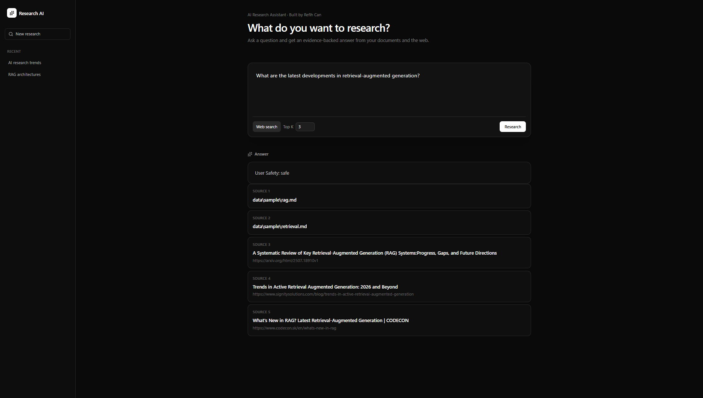

# AI Research Assistant

A local-first, citation-aware research assistant for turning documents and web pages into searchable evidence and grounded LLM answers.

## Demo

The web interface supports:

- Local document research
- Optional web search
- Configurable top-k retrieval
- Grounded LLM answers
- Source citations
- Clickable web sources

## What it does

The project implements a practical hybrid retrieval and reranking pipeline:

1. Ingest Markdown, text, PDF, HTML documents, and web pages while preserving their sources.
2. Crawl same-domain web pages with a configurable page limit.
3. Split documents into overlapping chunks.
4. Create dense embeddings with Sentence Transformers.
5. Persist chunks and embeddings to either a local NumPy index or Qdrant.
6. Retrieve candidates using both dense semantic search and BM25.
7. Combine retrieval results with reciprocal rank fusion.
8. Optionally rerank candidates with a CrossEncoder.
9. Optionally augment local evidence with Tavily web search results.
10. Optionally verify web sources before adding them to the evidence.
11. Expand queries with LLM-generated alternative search queries.
12. Ask the model to cite the supplied sources as [1], [2], etc.
13. Expose the research pipeline through a FastAPI service.
14. Provide a React/Vite web interface for interactive research queries.
15. Support local and web sources with clickable source metadata.
16. Configure retrieval depth and web search directly from the web interface.

Web search is opt-in through the CLI, keeping the default workflow local-first while allowing current web evidence when needed.

## Tech stack

- Python
- Sentence Transformers
- BM25 / scikit-learn
- Qdrant
- FastAPI
- React
- Vite
- Tailwind CSS
- Tavily
- HTTP-based LLM APIs
- Pytest

## Architecture

    Documents
        |
        v
    Ingestion -> Chunking + source metadata
        |
        v
    Sentence Transformer embeddings
        |
        +----------------------+
        |                      |
        v                      v
    Vector store           BM25 index
    (NumPy / Qdrant)           |
        |                      |
        +----------+-----------+
                   |
                   v
        Reciprocal rank fusion
                   |
                   v
        Optional CrossEncoder reranking
                   |
                   v
                   |
                   +----------------------+
                   |                      |
                   |                  --web
                   |                      |
                   |                      v
                   |               Tavily web search
                   |                      |
                   |                      v
                   +------------> Web evidence
                              |
                              v
                       Evidence context
                              |
                              v
                   HTTP-based LLM
                              |
                              v
                    Answer + source citations

The system separates retrieval, reranking, evidence construction, and generation so each stage can be evaluated independently.

## Features

- Markdown and plain-text ingestion
- PDF ingestion
- HTML/HTM ingestion
- Web page URL ingestion
- Tavily web search provider
- Same-domain web crawling with configurable page limits
- Opt-in web search through the CLI
- Optional HTTP source verification for web search results
- Overlapping chunking with source metadata
- Dense semantic retrieval
- BM25 lexical retrieval
- Hybrid dense + BM25 retrieval with reciprocal rank fusion
- Optional CrossEncoder reranking
- Persistent local NumPy index
- Qdrant vector store with local persistence
- Metadata filtering across dense and lexical retrieval
- Optional LLM-based query expansion
- OpenAI-compatible LLM endpoint
- Citation-oriented evidence formatting
- Retrieval and answer faithfulness evaluation
- CLI interface
- Unit tests
- Environment-based API configuration
- FastAPI backend with typed request and response models
- FastAPI service with health and research endpoints
- CORS configuration for the web frontend
- React/Vite web interface
- Markdown-rendered research answers
- Optional web search from the web interface
- Clickable web source links
- Configurable top-k retrieval from the API and web interface
- Health check endpoint
- Cached pipeline lifecycle for the API service
- No secrets committed to the repository

## Requirements

- Python 3.10+
- Node.js 20+
- Internet access on first run to download the embedding/reranker models
- An OpenAI-compatible LLM endpoint is optional
- A Tavily API key is required when using ask --web

Default embedding model:

    sentence-transformers/all-MiniLM-L6-v2

Optional reranker:

    cross-encoder/ms-marco-MiniLM-L6-v2

## Installation

    git clone https://github.com/canrefih/ai-research-assistant.git
    cd ai-research-assistant

    python -m venv .venv
    source .venv/bin/activate
    pip install -e ".[dev]"

On Windows PowerShell:

    .venv\Scripts\Activate.ps1
    pip install -e ".[dev]"

## Configuration

Copy the example environment file:

    cp .env.example .env

Then configure an OpenAI-compatible endpoint:

    LLM_BASE_URL=https://api.openai.com/v1
    LLM_API_KEY=your-api-key
    LLM_MODEL=your-model-name
    TAVILY_API_KEY=your-tavily-api-key

The client expects the standard chat-completions route:

    POST {LLM_BASE_URL}/chat/completions

The LLM is optional. Without configuration, the application still retrieves and prints evidence instead of pretending to have generated a grounded answer.

TAVILY_API_KEY is only required when web search is enabled with ask --web.

## Quickstart

### 1. Index your documents

Put research material in a directory such as:

    data/
    +-- papers/
    |   +-- paper-one.md
    |   +-- paper-two.md
    |   +-- notes.txt
    +-- sample/

Then run:

    research-assistant index data/papers

The generated local index is stored in data/index/ and is ignored by Git.

### 2. Ask questions

    research-assistant ask "What are the main advantages of retrieve-and-rerank?"

The index is loaded from disk, so the corpus is not re-embedded for every question.

### 3. Use web search

By default, ask uses the indexed local documents only.

To include Tavily web search results as additional evidence:

    research-assistant ask "What are the latest developments in retrieval augmented generation?" --web

The --web option combines the local retrieval evidence with web search results before sending the evidence to the LLM.

### 4. Run the web interface

Start the FastAPI backend from the project root:

    python -m uvicorn research_assistant.api:app

Then start the frontend in a second terminal:

    cd frontend
    npm install
    npm run dev

Open the development server URL shown by Vite, typically:

    http://localhost:5173

The web interface supports local retrieval, optional Tavily web search, configurable top-k retrieval, grounded LLM answers, and clickable web sources.

### 5. Disable reranking

    research-assistant ask "What is RAG?" --no-reranker

This is useful when you want a faster retrieval-only baseline.

### 6. Change retrieval depth

    research-assistant ask "How does semantic retrieval work?" --top-k 12

### 7. Use a custom index directory

    research-assistant index data/papers --index-dir data/my-research
    research-assistant ask "Summarize the findings" --index-dir data/my-research

### 8. Index a web page

    research-assistant index-url https://example.com/research

You can also choose a custom index directory:

    research-assistant index-url https://example.com/research --index-dir data/web-index

### 9. Crawl a web site

    research-assistant crawl-url https://example.com --max-pages 10

The crawler follows HTTP/HTTPS links on the same domain and indexes up to the configured number of pages.

You can also choose a custom index directory:

    research-assistant crawl-url https://example.com --max-pages 10 --index-dir data/web-crawl

### 10. Query expansion

You can expand the query into additional LLM-generated search queries before retrieval:

    research-assistant ask "What is RAG?" --query-expansion

Query expansion requires a configured LLM and performs an additional LLM call before retrieval.

### 11. Verify web sources

You can verify web search results before they are included in the evidence:

    research-assistant ask "What is RAG?" --web --verify-sources

Source verification performs HTTP requests to check whether web sources are reachable.

### 12. Evaluation benchmark

Run the retrieval benchmark against the evaluation dataset:

    research-assistant benchmark tests/data/golden.jsonl

The benchmark reports Recall@K, MRR, and NDCG.

To also evaluate answer faithfulness against the retrieved evidence:

    research-assistant benchmark tests/data/golden.jsonl --faithfulness

The faithfulness metric reports the supported claim ratio, which measures the proportion of answer claims that have sufficient lexical overlap with the retrieved evidence.

## API

The FastAPI service exposes:

    GET /health

Returns the service health status.

    POST /ask

Request:

    {
      "question": "What is retrieval-augmented generation?",
      "use_web_search": false,
      "top_k": 5
    }

The response contains the grounded answer and source metadata.

The interactive API documentation is available at:

    http://127.0.0.1:8000/docs

## Included example

The repository contains a tiny sample corpus in data/sample/.

    research-assistant index data/sample
    research-assistant ask "Why use a bi-encoder before a cross-encoder?"

## Project structure

    ai-research-assistant/
    +-- data/
    |   +-- index/                  # Local persisted index
    |   +-- sample/                 # Small example corpus
    +-- frontend/
    |   +-- src/
    |   |   +-- App.tsx              # Research interface
    |   |   +-- index.css            # Global styles
    |   |   +-- main.tsx             # Frontend entry point
    |   +-- package.json
    |   +-- vite.config.ts
    +-- research_assistant/
    |   +-- __init__.py
    |   +-- chunking.py             # Chunking and overlap
    |   +-- cli.py                  # Command-line interface
    |   +-- ingestion.py            # Document discovery/loading
    |   +-- llm.py                  # OpenAI-compatible LLM client
    |   +-- models.py               # Core data models
    |   +-- pipeline.py             # End-to-end orchestration
    |   +-- retrieval.py            # Dense, BM25, fusion, and reranking
    |   +-- storage.py              # Local index persistence
    |   +-- vector_store.py         # Vector-store protocol and Qdrant backend
    |   +-- web_search.py           # Web search provider abstraction and Tavily implementation
    |   +-- crawler.py              # Same-domain web crawling
    |   +-- query_expansion.py      # Query expansion strategies
    |   +-- source_verification.py  # Web source verification strategies
    |   +-- api.py                   # FastAPI application and API models
    |   +-- config.py                # Typed application configuration
    |   +-- logging_config.py        # Application logging configuration
    +-- tests/
    |   +-- test_bm25.py
    |   +-- test_chunking.py
    |   +-- test_cli.py
    |   +-- test_fusion.py
    |   +-- test_ingestion.py
    |   +-- test_models.py
    |   +-- test_pipeline.py
    |   +-- test_retrieval.py
    |   +-- test_reranker.py
    |   +-- test_storage.py
    |   +-- test_vector_store.py
    |   +-- test_web_search.py
    |   +-- test_crawler.py
    |   +-- test_query_expansion.py
    |   +-- test_source_verification.py
    |   +-- test_api.py
    |   +-- test_faithfulness.py
    |   +-- test_answer_quality.py
    |   +-- test_error_analysis.py
    +-- .env.example
    +-- .gitignore
    +-- pyproject.toml
    +-- README.md

## Design decisions

### Why hybrid retrieval?

Dense retrieval captures semantic similarity, while BM25 provides a strong lexical matching signal. Combining both result lists with reciprocal rank fusion improves retrieval robustness. Dense retrieval can use the lightweight local NumPy backend or Qdrant when a scalable vector-store architecture is needed.

### Why retrieve + rerank?

Dense and lexical retrieval efficiently produce a candidate set. A CrossEncoder then scores the candidates jointly with the query. This separates the broad retrieval stage from the more expensive precision stage.

### Why persist the index?

Embedding an entire corpus can be much more expensive than embedding one query. Persisting chunks and embeddings makes the tool reusable instead of rebuilding its index for every question.

The default local NumPy backend keeps the project lightweight, while Qdrant provides a persistent vector-store backend for larger corpora and future deployment scenarios.

### Why a standard chat-completions interface?

The LLM layer targets a common chat-completions interface rather than hard-coding one provider. Compatible hosted APIs and local inference servers can therefore be used without changing the retrieval pipeline.

## Current limitations

This is an early-stage research/RAG project, not a production platform.

- Web search is currently opt-in and requires a configured search provider.
- Web crawling is limited to same-domain pages and a configurable page count.
- Citations are source labels supplied to the LLM, not independently verified claims.
- Evaluation is currently based on a small golden-question dataset and deterministic retrieval/faithfulness metrics.
- The web interface currently runs as a separate Vite development server.
- The API currently uses a cached in-process research pipeline rather than a distributed service architecture.
- Web search quality depends on the configured external search provider.

These limitations are intentional extension points.

## Roadmap

### Retrieval
- [x] Hybrid BM25 + dense retrieval
- [x] Metadata filtering
- [x] Document deduplication
- [x] Configurable embedding/reranker models
- [x] Qdrant vector database backend

### Research workflow
- [x] PDF ingestion
- [x] HTML/web ingestion
- [x] Same-domain web crawling
- [x] Tavily search integration into the research pipeline
- [x] CLI web search option
- [x] Query expansion and multi-query retrieval
- [x] Source verification
- [x] Rich research report generation with source metadata

### Evaluation
- [x] Golden-question dataset
- [x] Recall@K, MRR and NDCG
- [x] Answer faithfulness checks
- [x] Answer quality evaluation
- [x] Retrieval-vs-generation error analysis

### Developer experience
- [x] CI with automated tests
- [x] Structured logging
- [x] Typed configuration object
- [x] FastAPI service
- [x] React/Vite web UI

## Development

Run the test suite:

    pytest

Install in editable mode:

    pip install -e ".[dev]"

## Contributing

Keep contributions focused and modular. Behavior changes should include tests where practical. Provider-specific code should remain isolated from the core retrieval pipeline.

## License

MIT